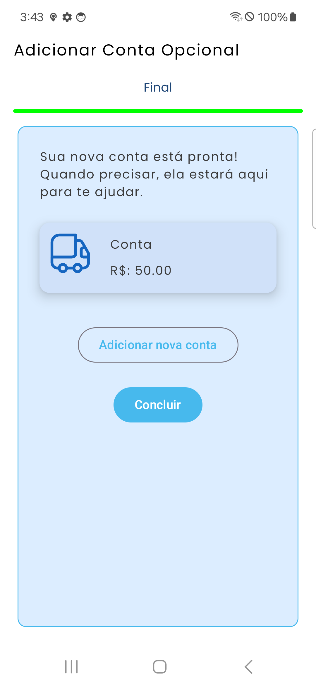

# 🌬️Breeze

Breeze is a modern and visually appealing  financial organization app designed to provide a smooth  and intuitive  user experience. Built with Jetpack Compose, Breeze ensures fluid animations  and a seamless navigation experience.

## ✨ Features

*  **Account Management (Fixed & Installments)**  
Create and manage **fixed** and **installment-based** accounts,with clear differentiation between them.
-  **Account Status Control**  
Mark accounts as **paid** or **pending**, enabling accurate tracking of your financial obligations.
-  **Income Management**  
Register and delete **income entries**, fully integrated into the app's financial flow.
-  **Chronogical Feed**  
Accounts and incomes are displayed in a **feed-style list**, ordered from the **most recent to the oldest**,
  making daily tracking intuitive.
- **Financial History & Insights**  
Access a dedicated **History** section to review past accounts and incomes with:
   * Detailed chronological data
   * Visual **charts** showing financial evolution over time
   * Clear separation between expenses and income history
 - **Visual Financial Overview**  
 Easily track and understand your finances through a clean and modern UI.
 - **Customizable UI**  
 Personalize your experience with expressive icons from the **Breeze Icons** library.
 - **Smooth Animations**  
 Fluid interactions and transitions designed to enhance the user experience.
 - **Local Data Persistence**  
 Uses **Room Database** for reliable and offline-first local data storage. 

## 🛠️ Technologies Used

-  [**Kotlin**](https://kotlinlang.org/docs/home.html)
-  [**Jetpack Compose**](https://developer.android.com/compose)
-  [**KSP**](https://kotlinlang.org/docs/ksp-overview.html)
-  [**Hilt for Dependency Injection**](https://developer.android.com/training/dependency-injection/hilt-android?hl=pt-br)
-  [**Room Database**](https://developer.android.com/jetpack/androidx/releases/room?hl=pt-br)
-  [**Breeze-Icons**](https://github.com/MiguelDK17/Breeze-Icons)
-  [**Lottie for animations**](https://github.com/airbnb/lottie-android)

## 📥 Installation

Currently, Breeze is under development  and not yet available for public installation. Stay tuned  for updates!

## 🖼️ Screenshots

## 🤝 Contribution
As of now, Breeze is in its early stages  of development and not open for contributions. However, feedback  and suggestions  are always welcome!

## 📜 License
Breeze is licensed under the Apache 2.0 License. See [LICENSE](https://github.com/MiguelDK17/Breeze/blob/master/LICENSE) for more details.

---

Stay updated by following our progress! 🚀✨
